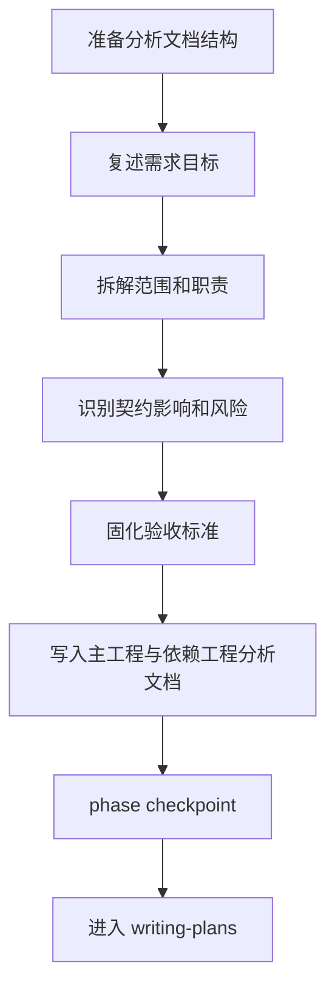

# Brainstorming

## 概述
`brainstorming` 的目标是把“描述性需求”变成“可执行分析输入”。

输出必须能直接被 `writing-plans` 消费，不能停留在抽象讨论。

## 开始声明
建议先声明：
> 我正在使用 `brainstorming` 做跨工程需求澄清和分析固化。

## HARD GATE
- `workflow-state` 不是 `init`，禁止执行。
- 未形成验收标准，禁止推进阶段。
- 依赖工程视角未覆盖，禁止推进阶段。

## 本 skill 自带资产
- 脚本：`skills/brainstorming/scripts/prepare_brainstorming_docs.sh`
  - `start-server.sh` / `stop-server.sh`（可视化伴侣服务）
  - `build-visual-state.sh`（把当前需求状态导出到 state.json）
- 模板：
  - `skills/brainstorming/templates/analysis-main.md`
  - `skills/brainstorming/templates/analysis-repo.md`

## 先执行文档预处理

```bash
bash skills/brainstorming/scripts/prepare_brainstorming_docs.sh \
  --main-dir <主工程绝对路径> \
  --requirement-key <需求key> \
  --deps <逗号分隔依赖工程绝对路径>
```

该脚本会自动补齐缺失章节，避免分析文档结构不完整。

## 必做清单
1. 复述需求目标与业务结果。
2. 明确范围内/范围外。
3. 拆解主工程与依赖工程职责。
4. 梳理契约影响（字段/状态/事件/防重口径）。
5. 列风险、防护与回滚点。
6. 给出可判定验收标准。

## 输出文件
主工程：`docs/requirements/<requirement_key>/01-analysis.md`

依赖工程：`docs/requirements/<requirement_key>/01-repo-analysis.md`

补充认知（人工维护，不覆盖）：
- `10-repo-perspective-custom.md`
- `11-repo-contract-custom.md`

## 流程图



## 可视化伴侣（可选）
当你需要给多工程需求做可视化讲解时：

1) 构建状态文件
```bash
bash skills/brainstorming/scripts/build-visual-state.sh \
  --main-dir <主工程绝对路径> \
  --requirement-key <需求key> \
  --deps <逗号分隔依赖工程绝对路径> \
  --feature-branch <feature_...> \
  --out-file skills/brainstorming/scripts/state.json
```

2) 启动服务
```bash
bash skills/brainstorming/scripts/start-server.sh
```

3) 浏览器打开（本地）：`http://127.0.0.1:3901`

4) 停止服务
```bash
bash skills/brainstorming/scripts/stop-server.sh
```

## 阶段推进命令

```bash
bash skills/init/scripts/phase_checkpoint.sh \
  --main-dir <主工程绝对路径> \
  --deps <逗号分隔依赖工程绝对路径> \
  --requirement-key <需求key> \
  --phase brainstorming \
  --owner <agent-id>
```

## 常见失败与恢复
- 失败：分析章节缺失。
  - 恢复：重跑 `prepare_brainstorming_docs.sh`。
- 失败：依赖工程口径不一致。
  - 恢复：先统一主工程 `01-analysis.md`，再触发同步检查点。
- 失败：并发状态冲突。
  - 恢复：检查 `workflow-state.json` 版本，按实际相位续跑。

## 反模式
- 只有主工程分析，依赖工程空白。
- 只有改动点，没有业务目标和验收标准。
- 口头确认后直接进编码，不落文档。

## 完成定义
- `01-analysis.md` 结构完整、可执行。
- 所有依赖工程有对应分析视角。
- `phase_checkpoint` 返回 `CHECKPOINT_DONE`。

下一阶段：`writing-plans`

## 示例
- `skills/brainstorming/visual-companion.md`
- `skills/brainstorming/spec-document-reviewer-prompt.md`
- `skills/brainstorming/spec-analysis-reviewer-prompt.md`
- `skills/brainstorming/examples/sample-analysis.md`

