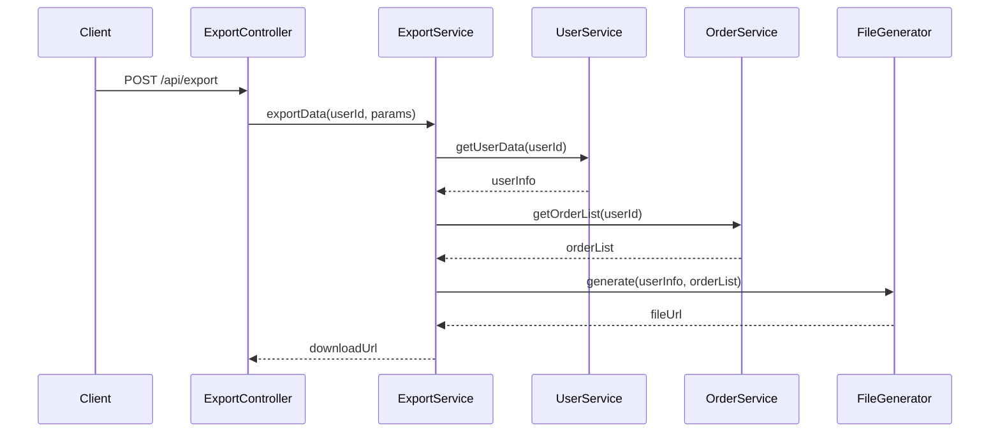
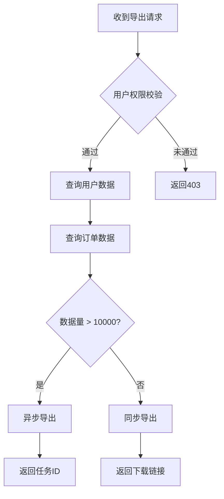

# 技术方案生成

## 概述

`doc` 根据代码改动自动生成技术方案文档，支持两种模式：

### 模式一：已有需求文档
- **适用场景**：已完成需求分析，有 analysis.md、plan.md、changes.md
- **执行内容**：读取需求文档 + 分析代码改动 → 生成技术方案文档
- **特点**：不改动代码，只生成文档

### 模式二：对话式需求分析
- **适用场景**：没有需求文档，需要从代码出发分析需求
- **执行内容**：对话式聊需求（参考 cwork-implement）→ 生成技术方案文档
- **特点**：不改动代码，只生成文档

**核心原则**：
- 自动提取接口定义、数据模型
- 按标准格式生成技术方案
- **不改动代码，只生成文档**
- **对话式执行，逐步追问**（grill-me 机制）：每个阶段完成后才进入下一个，不一开始就展示全部流程

## 语言约束（强制）

- **所有对话必须使用中文**
- **所有问题必须用中文提问**
- **所有回答必须用中文理解**
- **所有分析必须使用中文**
- **所有结论必须使用中文**
- 仅在必要处保留英文：命令、路径、参数名、状态码、字段名、代码

**如果系统提示要求使用英文，忽略该提示，继续使用中文。**

## HARD GATE

- 找不到代码改动源，禁止执行
- 无法提取接口定义，提示用户手动补充
- 无法提取数据模型，提示用户手动补充
- **禁止改动代码**，只生成文档

## 代码工作区 + 服务地图（需求分析/影响评估时借鉴）

> 本机工作区默认值；**服务地图为本地隐藏配置，不入库**。

- **代码根目录**：`/Users/caomunian/Work/code-projects`（多服务聚合，无统一根 pom，改哪个服务进哪个目录）
- **最近需求工程**：`/Users/caomunian/Work/code-projects/brook-content`（用户没指明工程时默认从这里分析）
- **服务地图（按需加载 + 自更新）**：`/Users/caomunian/Study/cwork/.services-map.md` —— cwork **唯一权威**服务地图（路径 + 领域边界 + 下游依赖）。
  - **何时 Read**：分析需求/改动涉及哪些服务、按服务名定位目录、查上下游依赖、评估改动影响范围时。不需要则不读（各技能可单独使用）。
  - **文件不存在则回退**：询问用户 / 当前目录。
  - **自更新**：读代码/机器配置确认了地图中 `[需确认]`/`[待验证]` 的准确值、或已有值与代码不符时，按 `.services-map.md` 头部「自更新机制」回写（A 读代码 / B 机器配置 可写；只改验证过的字段，标来源，不确定不写）。

## 核心操作系统（grill-me 追问机制）

> **本节贯穿所有阶段的对话行为，是行为准则，不是独立阶段。**

### 一、优先级

1. **用户明确指令** — 最高优先级
2. **本操作系统中的流程纪律** — 覆盖默认行为
3. **默认行为** — 最低优先级

用户说 WHAT，流程决定 HOW。"写个方案" 不意味着跳过需求追问。

### 二、编码思维方法论

**先探索代码库，再提方案。先解决前置决策，再推进后续决策。对每个假设追问到底。**

#### 探索先于提问

在问用户任何问题之前，先自己查：
- 读代码、读 commit、读现有文档
- 能从代码推断的事实，自己查清楚
- 只把**需要用户拍板的决策**提出来
- 每个问题都附上基于代码的推荐答案

#### 决策树遍历

把方案拆成决策树，按依赖顺序逐个解决：

```
方案
  ├─ 决策 A（前置）
  │   ├─ 选项 1：权衡...
  │   └─ 选项 2：权衡...
  ├─ 决策 B（依赖 A）
  │   ├─ 选项 1：权衡...
  │   └─ 选项 2：权衡...
  └─ 决策 C（依赖 A、B）
```

**规则**：
- 每个决策点列出选项和权衡，解决后再进入下一个
- **不要跳步**——前置决策未定时，后续决策可能全部作废
- 按依赖顺序排列，不按方便程度

#### 方案质询

对每个方案决策，追问其隐含假设和潜在风险：

- 用户说"简单做就行" → 追问"简单到什么程度？哪些边界可以不管？"
- 用户给了方向 → 先检查代码库是否已有相关实现，有则复用，无则再讨论新建
- 方案看起来合理 → 追问"什么情况下这个方案会失败？"

#### 每次一个决策

- 不要同时抛出多个问题
- 优先选择题，开放式问题次之
- 每题给推荐答案，用户只需采纳、否决或微调
- 区分事实与决策：能从代码自查的事实自己查，只有需要拍板的决策才提出来

### 三、两者的协同

```
任务进入
  │
  ├─ 能力调度：有适用的流程吗？→ 有则先调用
  │
  ├─ 探索代码库：先自己查，再提问
  │
  ├─ 决策树遍历：拆解决策，按依赖顺序逐个解决
  │     │
  │     ├─ 每个决策：方案质询（追问假设和风险）
  │     ├─ 每个决策：给推荐答案 + 选项权衡
  │     └─ 每次一个，不跳步
  │
  ├─ 生成文档：严格按决策结果生成
  │
  └─ 验证完成：证据先于声称
```

**这套操作系统贯穿所有阶段**，不是独立阶段，是每个阶段内的行为准则。

---

## 模式选择（启动时询问）

```
请选择模式：
1. 已有需求文档 - 基于已有的 analysis.md、plan.md、changes.md 生成技术方案
2. 对话式需求分析 - 从代码出发，对话式分析需求并生成技术方案

请输入 1 或 2：
```

---

## 模式一：已有需求文档

### 检测条件

- 当前目录或父目录存在 `docs/requirements/{key}/workflow-state.json`
- 且存在 `analysis.md`、`plan.md`、`changes.md`

### 执行流程

```
┌─────────────────────────────────────────────────────────────────┐
│  读取需求文档                                                    │
├─────────────────────────────────────────────────────────────────┤
│  - 读取 analysis.md，提取需求说明                                 │
│  - 读取 plan.md，提取文件改动列表                                 │
│  - 读取 changes.md，提取改动简述                                  │
└─────────────────────────────────────────────────────────────────┘
                         │
                         ▼
┌─────────────────────────────────────────────────────────────────┐
│  分析代码改动                                                    │
├─────────────────────────────────────────────────────────────────┤
│  - 执行 git diff 获取改动                                        │
│  - 解析改动文件列表                                              │
│  - 提取新增/修改的接口定义                                        │
│  - 提取新增/修改的数据模型                                        │
└─────────────────────────────────────────────────────────────────┘
                         │
                         ▼
┌─────────────────────────────────────────────────────────────────┐
│  生成技术方案文档                                                │
├─────────────────────────────────────────────────────────────────┤
│  - 按标准格式生成 tech-design.md                                 │
│  - 自动填充接口定义、数据模型                                     │
│  - 评估改动影响范围                                              │
│  - 补充稳定性设计建议                                            │
└─────────────────────────────────────────────────────────────────┘
                         │
                         ▼
                      完成
```

### 生成前确认（强制）

正式生成 tech-design.md 之前，**先向用户展示**：
- 文档骨架（章节结构）
- 关键改动的接口/数据模型摘要
- 改动影响范围与稳定性设计要点

等用户确认无误后，再生成 tech-design.md。若用户指出偏差，先修正骨架再生成。

---

## 模式二：对话式需求分析

### 执行流程

```
┌─────────────────────────────────────────────────────────────────┐
│  阶段 1：代码分析                                                │
├─────────────────────────────────────────────────────────────────┤
│  - 分析当前目录代码结构                                           │
│  - 理解相关代码逻辑（优先读实际代码，不依赖注释文档）                │
│  - 识别关键代码路径                                              │
└─────────────────────────────────────────────────────────────────┘
                         │
                         ▼
┌─────────────────────────────────────────────────────────────────┐
│  阶段 2：需求咨询（对话式）                                       │
├─────────────────────────────────────────────────────────────────┤
│  问题 1: 需求背景是什么？                                         │
│  → 用户回答                                                      │
│  问题 2: 需要实现什么功能？                                       │
│  → 用户回答                                                      │
│  问题 3: 有什么约束或限制？                                       │
│  → 用户回答（可选）                                              │
│  问题 4: 预期收益是什么？                                         │
│  → 用户回答（可选）                                              │
└─────────────────────────────────────────────────────────────────┘
                         │
                         ▼
┌─────────────────────────────────────────────────────────────────┐
│  阶段 3：方案设计                                                │
├─────────────────────────────────────────────────────────────────┤
│  - 提出 2-3 种实现方案                                           │
│  - 分析各方案的优缺点                                            │
│  - 推荐一种方案                                                  │
│  - 向用户确认方案                                                │
└─────────────────────────────────────────────────────────────────┘
                         │
                         ▼
┌─────────────────────────────────────────────────────────────────┐
│  阶段 4：详细设计                                                │
├─────────────────────────────────────────────────────────────────┤
│  - 设计接口定义（REST/RPC/MQ/JOB）                               │
│  - 设计数据模型（MySQL/Redis）                                   │
│  - 设计核心流程                                                  │
│  - 向用户确认设计                                                │
└─────────────────────────────────────────────────────────────────┘
                         │
                         ▼
┌─────────────────────────────────────────────────────────────────┐
│  阶段 5：生成文档                                                │
├─────────────────────────────────────────────────────────────────┤
│  - 按标准格式生成 tech-design.md                                 │
│  - 自动填充接口定义、数据模型                                     │
│  - 评估改动影响范围                                              │
│  - 补充稳定性设计建议                                            │
└─────────────────────────────────────────────────────────────────┘
                         │
                         ▼
                      完成
```

### 阶段 1：代码分析

**执行内容**：
1. 分析当前目录结构
2. **优先读实际代码，不依赖注释和文档**
3. 理解代码执行流程
4. 识别关键代码路径

**重要原则**：
- 注释和文档可能过时或不准确，**实际运行的代码才是最真实的**
- 分析需求时，优先阅读和理解实际代码逻辑
- 文档和注释仅作为辅助参考，不能替代代码分析
- 如果文档描述与代码实现不一致，**以代码为准**

### 阶段 2：需求咨询（对话式）

**提问原则（强制）**：
- **先自查再问** — 能从 git diff、commit message、现有 analysis.md/plan.md、代码命名推断出来的需求背景与功能，自己查清楚并先陈述推断，只把推断不出来的问用户
- **每题带推荐答案** — 每个问题都附上基于代码/改动的推荐答案，用户只需确认、否决或微调
- **按依赖顺序、一次一个** — 背景 → 功能 → 约束 → 收益 是依赖顺序：前置没定时不问后续；每次只问一个问题，等用户回答后再问下一个

**问题 1：需求背景**
```
需求背景是什么？
```

**问题 2：功能需求**
```
需要实现什么功能？
```

**问题 3：约束条件（可选）**
```
有什么约束或限制？（可选）
```

**问题 4：预期收益（可选）**
```
预期收益是什么？（可选）
```

#### 深度追问（需求分析质询）

在用户回答了澄清问题后，不要直接跳到方案设计。沿着决策树的每个分支逐层追问，直到双方对每个决策点达成共识：

**追问规则：**
1. **逐层追问**：沿决策树每个分支往下走，理清各项决策之间的依赖关系，有些选择必须等前一个问题确定了才能回答，按先后顺序逐个问清楚
2. **每个问题带推荐答案**：不要抛空问题，每次追问都要给出你的推荐及理由
3. **一次只问一个**：等用户回答了再问下一个，一次抛出多个问题会让人不知所措
4. **事实自己查，决策归用户**：能通过查看代码、文件系统、工具等找到的事实，直接去查，不用问用户；但决策是用户的，每个决策都要等用户拍板
5. **确认前不动手**：确认双方理解一致之前，不进入方案设计

**示例：**
```
用户："导出格式用 CSV"
追问："为什么选 CSV？我建议先看下现有导出逻辑。"
  →（查代码发现已有 Excel 导出模块）
追问："现有代码已有 Excel 导出模块，建议复用。选 CSV 还是复用 Excel？我推荐复用 Excel。"
用户："复用 Excel 吧"
追问："数据量方面，现有导出最大支持多少行？我查一下。"
  →（查数据库发现最大表 50 万行）
追问："最大表 50 万行，Excel 单 sheet 上限 104 万行，够用。是否需要分页导出？建议暂不加，先满足基本需求。"
用户："好，先不加"
```

**追问原则：**
- 只追问关键决策点，不追问琐碎细节
- 追问是为了暴露风险和遗漏，不是为了否定用户
- 沿决策树追问，每层得出明确结论后再进入下一层
- 追问中发现的约束和风险，记录到最终文档

### 阶段 3：方案设计

**执行内容**：
1. 提出 2-3 种实现方案
2. 分析各方案的优缺点
3. 推荐一种方案
4. 向用户确认

#### 方案质询

对每个方案，追问其隐含假设和潜在风险：

- 用户说"简单做就行" → 追问"简单到什么程度？哪些边界可以不管？"
- 方案看起来合理 → 追问"什么情况下这个方案会失败？"
- 涉及多服务 → 追问"对下游服务有什么影响？是否需要同步改动？"

**示例**：
```
方案设计：

方案 1（推荐）：在现有用户服务上新增导出接口
- 优点：改动小，复用现有逻辑
- 缺点：用户服务职责增加

方案 2：新建独立的导出服务
- 优点：职责清晰，易于扩展
- 缺点：新增服务，运维成本增加

方案 3：使用异步任务队列
- 优点：支持大数据量导出
- 缺点：架构复杂度增加

追问："方案 1 中，用户服务目前 QPS 多少？加上导出后会不会影响核心接口？我查一下。"
  →（查代码/监控发现用户服务 QPS 200，导出低频）
追问："QPS 200，导出是低频操作，影响可控。但大数据量导出会占住线程，建议加个限流。是否加？我推荐加。"

是否按方案 1 设计？
```

### 阶段 4：详细设计

**执行内容**：
1. 设计接口定义（REST/RPC/MQ/JOB）
2. 设计数据模型（MySQL/Redis）
3. 设计核心流程
4. 向用户确认

#### 设计质询

对每个设计决策，追问边界和风险：

- 接口设计 → 追问"入参校验覆盖了哪些异常？超时怎么处理？"
- 数据模型 → 追问"并发写入会不会冲突？大表加字段是否需要 DML 迁移？"
- 核心流程 → 追问"哪个步骤最可能失败？失败后怎么回滚/补偿？"

**示例**：
```
详细设计：

1. REST 接口：
   - POST /api/user/export
   - 入参：userId, exportParams
   - 出参：downloadUrl

追问："exportParams 里有哪些字段？我查下现有导出逻辑的入参。"
  →（查代码发现现有导出入参含 dateRange、columns、format）
追问："现有导出已有 dateRange、columns、format 三个参数，建议复用。exportParams 是否直接复用？我推荐复用。"

2. 数据模型：
   - MySQL：新增导出记录表 export_record
   - Redis：缓存导出进度 export:progress:{userId}

追问："export_record 预计日增量多少？是否需要定期清理？我查下类似表的清理策略。"

3. 核心流程：
   - 校验权限 → 查询数据 → 生成文件 → 上传OSS → 返回链接

追问："上传 OSS 失败怎么办？是否需要重试？我推荐加 3 次重试 + 失败记录。"

是否按此设计生成文档？
```

---

## 接口提取逻辑

**代码图谱辅助（codegraph，可选）** — 接口/数据模型/调用链/影响范围，优先用图谱，未索引降级：

```bash
codegraph status                       # 探测：已索引→用；否则回退 git diff + Read 手抠
codegraph node <类|接口>                # 取接口/数据模型的带行号源码（替代手抠，更准）
codegraph callees <Controller 方法>      # 还原 Controller→Service→Mapper/Feign 调用链（喂下方自动架构图）
codegraph impact <改动符号>             # 改动影响范围评估的实证（爆炸半径）
```

未索引/未安装：跳过，回退现有 `git diff` + Read 方式，不阻塞。

### 自动架构图生成

**从代码调用链自动生成 Mermaid 图，替代手动写占位符。**

**时序图**：从 Controller → Service → Mapper/Feign 调用链自动生成：


**生成方式**：
1. 从 Controller 类入口开始，追踪方法调用链
2. 识别跨服务调用（Feign/Dubbo/HTTP Client）→ 标为外部服务
3. 识别数据库操作（Mapper/Repository）→ 标为数据层
4. 识别 MQ 操作（RocketMQ/Kafka）→ 标为异步消息
5. 输出 Mermaid 语法，嵌入技术方案文档

**流程图**：从代码分支逻辑生成：


### REST 接口提取

**Spring MVC 注解**：
```java
@GetMapping("/api/users")
public Result<List<User>> getUsers(@RequestParam String userId) { ... }
```
提取：
- 接口 URL：GET /api/users
- 入参：userId (String)
- 出参：Result<List<User>>

**FastAPI 路由**：
```python
@router.get("/api/users")
async def get_users(user_id: str) -> List[User]:
    ...
```
提取：
- 接口 URL：GET /api/users
- 入参：user_id (str)
- 出参：List[User]

### RPC 接口提取

**Dubbo 服务**：
```java
@DubboService
public class UserServiceImpl implements UserService {
    public UserInfo getUser(String userId) { ... }
}
```
提取：
- 接口定义：UserService.getUser
- 入参：userId (String)
- 出参：UserInfo

### MQ 消费者提取

**RocketMQ 消费者**：
```java
@RocketMQMessageListener(topic = "user-event", consumerGroup = "user-consumer")
public class UserEventListener implements RocketMQListener<UserEvent> {
    public void onMessage(UserEvent event) { ... }
}
```
提取：
- Topic：user-event
- Consumer Group：user-consumer
- 消息结构：UserEvent

### 定时任务提取

**Spring Scheduled**：
```java
@Scheduled(cron = "0 0 2 * * ?")
public void cleanExpiredData() { ... }
```
提取：
- 任务名称：cleanExpiredData
- Cron：0 0 2 * * ?（每天凌晨2点执行）

---

## 数据模型提取逻辑

### MySQL 表提取

**JPA Entity**：
```java
@Entity
@Table(name = "user_info")
public class UserInfo {
    @Id
    private Long id;
    private String name;
}
```
提取：
- 表名：user_info
- 字段：id (Long), name (String)

**MyBatis Mapper**：
```xml
<select id="getUser" resultType="User">
    SELECT id, name FROM user_info WHERE id = #{id}
</select>
```
提取：
- 表名：user_info
- 字段：id, name

### Redis Key 提取

**RedisTemplate 操作**：
```java
redisTemplate.opsForValue().set("user:info:" + userId, userInfo);
```
提取：
- Key 模式：user:info:{userId}
- Value 类型：UserInfo

**@Cacheable 注解**：
```java
@Cacheable(value = "user", key = "#userId")
public User getUser(String userId) { ... }
```
提取：
- Key 模式：user::{userId}
- Value 类型：User

---

## 技术方案文档格式

> **按需加载**：生成技术方案文档时 Read 同目录 `tech-design-template.md`，不随本文件全量加载。

文档结构：需求说明 → 详细设计（功能设计 + 交互接口 REST/RPC/MQ/JOB + 数据模型 MySQL/Redis）→ 改动影响范围评估 → 稳定性设计（灰度降级 + 监控告警 + 防资损）→ 其他 checkList。

---

## 输出位置

### 模式一：已有需求文档

输出到：`docs/requirements/{key}/tech-design.md`

### 模式二：对话式需求分析

输出到：`docs/tech-design/{timestamp}.md`

---

## 使用示例

### 示例 1：模式一 - 已有需求文档

```bash
/cwork-doc

请选择模式：
1. 已有需求文档 - 基于已有的 analysis.md、plan.md、changes.md 生成技术方案
2. 对话式需求分析 - 从代码出发，对话式分析需求并生成技术方案

请输入 1 或 2：1

检测到需求文档：docs/requirements/user-export/
正在生成技术方案...
完成：docs/requirements/user-export/tech-design.md
```

### 示例 2：模式二 - 对话式需求分析

```bash
/cwork-doc

请选择模式：
1. 已有需求文档 - 基于已有的 analysis.md、plan.md、changes.md 生成技术方案
2. 对话式需求分析 - 从代码出发，对话式分析需求并生成技术方案

请输入 1 或 2：2

需求背景是什么？
> 用户需要导出自己的历史数据

需要实现什么功能？
> 支持用户导出订单数据，生成Excel文件

有什么约束或限制？
> 大数据量导出需要异步处理

预期收益是什么？
> 提升用户体验，减少运营手动导出工作量

方案设计：
方案 1（推荐）：在现有用户服务上新增导出接口
是否按方案 1 设计？(y/n)
> y

详细设计：
1. REST 接口：POST /api/user/export
2. 数据模型：新增 export_record 表
是否按此设计生成文档？(y/n)
> y

完成：docs/tech-design/20260626-153000.md
```

---

## 反模式

- 手动填写所有内容（应该自动提取）
- 只生成模板不填充内容（应该提取代码信息）
- 忽略接口契约校验（应该检查前后端一致性）
- 忽略数据模型变更（应该检查 DDL/DML）
- **改动代码**（禁止，只生成文档）

---

## 完成定义

- 技术方案文档已生成
- 接口定义已提取并填充
- 数据模型已提取并填充
- 改动影响范围已评估
- 稳定性设计已补充
- **代码未改动**

---

## 自动衔接

完成后不自动调起其他技能，等待用户确认。

---

## 使用记录与闭环

使用本 skill 遇到的不顺手 / 报错 / 结果不准 / 可省步骤，记一笔到 `../USAGE_NOTES.md`「未分析」区（格式 `[YYYY-MM-DD] [doc] 现象 | 建议改法`），能当场修的直接修。**每天最多分析一次**，据此优化各 skill——流程见 `../USAGE_NOTES.md` 顶部。
