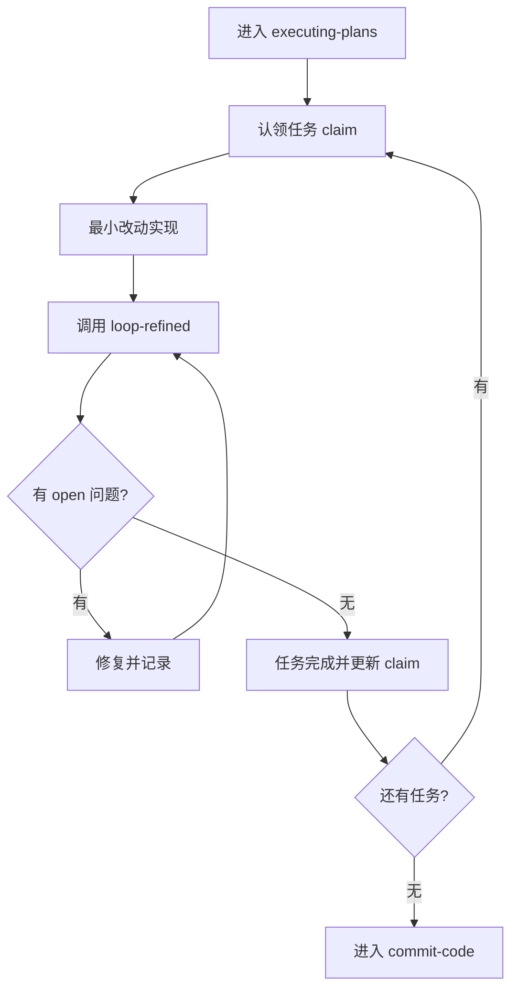

# Executing Plans

## 概述
`executing-plans` 承担“落地实现 + 任务编排 + 推演联动”。

核心原则：每个任务都必须经过 `loop-refined` 证实，不能只看代码改完。

## 开始声明
建议先声明：
> 我正在使用 `executing-plans` 按计划执行并触发推演修复闭环。

## HARD GATE
- `workflow-state` 不是 `writing-plans` 或 `executing-plans`，禁止执行。
- 未完成任务认领，禁止开始并发执行。
- 任一任务未过推演验证，禁止标记任务完成。

## 本 skill 自带资产
- 脚本：`skills/executing-plans/scripts/claim_and_start_task.sh`
- 模板：`skills/executing-plans/templates/task-log.md`

## 进入阶段检查点

```bash
bash skills/init/scripts/phase_checkpoint.sh \
  --main-dir <主工程绝对路径> \
  --deps <逗号分隔依赖工程绝对路径> \
  --requirement-key <需求key> \
  --phase executing-plans \
  --owner <agent-id>
```

## 任务启动脚本

```bash
bash skills/executing-plans/scripts/claim_and_start_task.sh \
  --repo <工程绝对路径> \
  --requirement-key <需求key> \
  --agent-id <agent-id> \
  --task-id <task-id> \
  --note "<任务说明>"
```

该脚本会：
- 校验当前工程状态必须是 `executing-plans`。
- 写入 `agent-claims`（claimed -> in_progress）。
- 生成 `process/task-<task-id>.md` 任务记录。

## 执行节奏（单任务）
1. 认领任务并建任务日志。
2. 最小改动实现当前目标。
3. 进入 `loop-refined` 做一轮推演。
4. 修复发现问题并更新文档。
5. 再推演确认无回归。
6. 更新 claim 状态为 `done/closed`。

## 并发模式（多 agent）
- 按工程或按模块切分任务，避免同文件冲突。
- 状态推进统一走 `phase_checkpoint.sh`，禁止手工改 state 文件。
- 长任务期间定期续租锁，避免锁过期后并发抢写。


## 与并发子代理集成（推荐）
当任务可按工程切分时，优先配合 `subagent-driven-development`：
1. 控制代理拆解任务并分配 ownership。
2. 子代理通过 claim 机制领取任务。
3. 每任务完成后先审查规格一致性，再审查代码质量。

## 流程图


## 常见失败与恢复
- 失败：claim 冲突（任务已被其他 agent 认领）。
  - 恢复：重选任务或等待释放。
- 失败：中途状态被推进。
  - 恢复：读取最新 state 后按相位续跑。
- 失败：任务日志缺失，难追溯。
  - 恢复：补写 `process/task-*.md` 并回填关键决策。

## 反模式
- 不认领任务，直接并发改代码。
- 改完不推演，直接进入提交。
- 任务完成但不更新 claim 状态。

## 完成定义
- 所有计划任务达成 DoD。
- 所有关键问题完成修复并关闭。
- 所有任务 claim 处于 `done/closed` 或已归档。

下一阶段：`loop-refined`（循环内） -> `commit-code`

## 示例
- `skills/executing-plans/execution-report-template.md`
- `skills/executing-plans/examples/sample-task-log.md`

