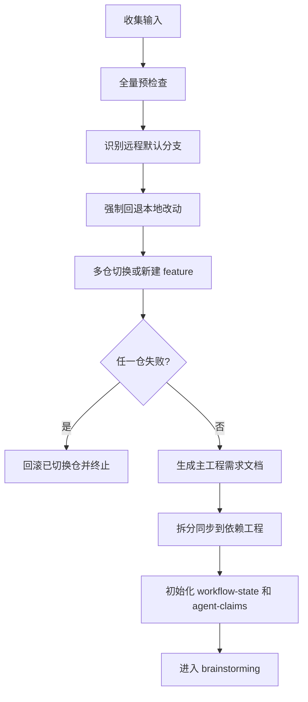

# 初始化

## 概述

## 语言约束
- 对话、分析、结论、提示默认使用中文。
- 仅在必要处保留英文：命令、路径、参数名、状态码、字段名。
- 禁止输出英文整句作为主要内容。

`init` 是 cwork 的唯一入口。它负责把“零散对话”转成“可执行多工程流水线”。

执行成功后会完成三件事：
1. 主工程与依赖工程统一进入同名 feature 分支。
2. 需求文档在主工程与依赖工程自动落地。
3. 后续阶段的状态机与并发治理文件自动初始化。

## 开始声明
执行前建议先声明：
> 我正在使用 `init` 初始化 cwork 多工程需求工作区。

## 强制逐步引导对话（必须按顺序）
- `init` 阶段必须采用“单问题、逐条确认”的中文对话，不得一次抛出多个问题。
- 每条问题都要等待用户回答后，才能进入下一条。
- 禁止在 `init` 阶段使用英文整句提问。

按以下顺序逐条提问：
1. `请先告诉我本次需求名称（需求标题）是什么？`
2. `本次需求涉及哪些工程服务目录？请给我绝对路径，多个用逗号分隔。`
3. `本次需求需要统一创建/切换的分支名称是什么？请提供完整 feature 分支名。`
4. `请确认是否允许强制回退未提交改动并继续切分支？请明确回复：是/否。`

补充约束：
- 若第 2 条未提供依赖工程，必须再次追问，不得直接继续。
- 若第 3 条分支名不合法，必须中文说明原因并要求重输。
- 若第 4 条不是“是”，必须停止执行 `init`。

## HARD GATE
- 未提供 `--force-discard true`，禁止执行。
- 任一依赖工程路径无效，禁止执行。
- 任一仓库不是 git 仓库或缺少 `origin`，禁止执行。
- `feature` 命名不符合规则，禁止执行。

## 本 skill 自带资产
- 脚本：`skills/init/scripts/*`
  - `validate_microservice_scope.sh`（微服务多工程范围守卫）
  - `generate_service_manifest.sh`（服务拓扑与职责清单）
  - `run_cwork_pipeline.sh`（阶段串联推进器）
- 模板：`skills/init/templates/requirement-manifest.md`


## 用户输入采集顺序
按以下顺序采集，不能跳步：
1. 主工程目录（默认当前目录）
2. 依赖工程目录列表（绝对路径）
3. feature 分支名
4. `requirement_key`
5. `requirement_title`
6. 强制回退确认（`--force-discard true`）

## 分支命名规则
- 必须以 `feature_` 开头。
- 仅允许字母与下划线。
- 禁止数字、中文、短横线。
- 下划线分段后，每段满足：`^[a-z][A-Za-z]*$`。

示例：
- `feature_userCenterExport`
- `feature_chargeFlowAlign_orderSync`


## 微服务范围守卫
在多工程微服务场景下，建议先校验工程范围：

```bash
bash skills/init/scripts/validate_microservice_scope.sh \
  --main-dir <主工程绝对路径> \
  --deps <逗号分隔依赖工程绝对路径> \
  --expect-multi true
```

再生成服务拓扑清单：

```bash
bash skills/init/scripts/generate_service_manifest.sh \
  --main-dir <主工程绝对路径> \
  --requirement-key <需求key> \
  --deps <逗号分隔依赖工程绝对路径> \
  --feature-branch <feature_...>
```

输出：`docs/requirements/<key>/07-service-topology.md`。

## 执行主命令

```bash
bash skills/init/scripts/init_requirement_workspace.sh \
  --main-dir <主工程绝对路径> \
  --deps <逗号分隔依赖工程绝对路径> \
  --feature-branch <feature_...> \
  --requirement-key <需求key> \
  --requirement-title "<需求标题>" \
  --force-discard true
```

## 自动执行逻辑
1. 全量预检查：路径、git、origin、远程可拉取。
2. 识别默认分支：优先 `origin/HEAD`，回退 `master/main`。
3. 强制清理本地改动：`reset --hard` + `clean -fd`。
4. 默认分支对齐远程最新。
5. feature 分支处理：
   - 本地已存在：强制切换
   - 远程已存在：跟踪切换
   - 都不存在：从最新默认分支新建
6. 多仓原子回滚：任一仓失败，已切换仓自动回滚到原引用。
7. 文档和状态文件初始化。

## 主流程图


## 产物清单
主工程：`docs/requirements/<requirement_key>/`
- `00-context.md`
- `01-analysis.md`
- `02-plan.md`
- `03-changes.md`
- `04-process-record.md`
- `05-split-actions.md`
- `dependencies/*`
- `process/*`
- `commit-allowlist.txt`

依赖工程：`docs/requirements/<requirement_key>/`
- `00-repo-context.md`
- `01-repo-analysis.md`
- `02-repo-plan.md`
- `03-repo-changes.md`
- `10-repo-perspective-custom.md`（人工维护，不覆盖）
- `11-repo-contract-custom.md`（人工维护，不覆盖）
- `98-main-doc-links.md`
- `99-dispatch-receipt.md`
- `commit-allowlist.txt`

每个工程都会生成：
- `docs/requirements/ACTIVE_REQUIREMENT.md`
- `docs/requirements/ACTIVE_REQUIREMENT_HISTORY.md`
- `docs/requirements/<key>/workflow-state.json`
- `docs/requirements/<key>/agent-claims.json`

## 并发治理能力
`init` 后默认启用：
- `workflow_state.sh`：阶段状态机 + 版本 CAS。
- `workflow_lock.sh`：目录锁 + TTL + renew。
- `agent_claims.sh`：任务认领、更新、归档。

## 常见失败与恢复
- 失败：远程默认分支无法识别。
  - 恢复：修复 `origin/HEAD` 或确认 `master/main` 后重跑。
- 失败：某仓切换失败。
  - 恢复：脚本会自动回滚，修复错误后重跑 `init`。
- 失败：误用强制回退导致本地改动丢失。
  - 恢复：只能依赖 git 历史、reflog 或外部备份。

## 反模式
- 只切主工程，不切依赖工程。
- 先手工切分支再补跑 `init`。
- 不记录 `requirement_key` 直接进后续阶段。

## 完成判定
- 所有工程处于同名 feature 分支。
- 主/依赖工程文档目录完整。
- 活跃需求标记存在。
- 返回 `NEXT_SKILL=brainstorming`。

下一阶段：`brainstorming`

## 示例
- `skills/init/init-input-checklist.md`
- `skills/init/examples/sample-init-command.md`


## 一键串联阶段推进（可选）

```bash
bash skills/init/scripts/run_cwork_pipeline.sh \
  --main-dir <主工程绝对路径> \
  --deps <逗号分隔依赖工程绝对路径> \
  --requirement-key <需求key> \
  --owner <agent-id> \
  --from-phase brainstorming \
  --to-phase commit-code
```
