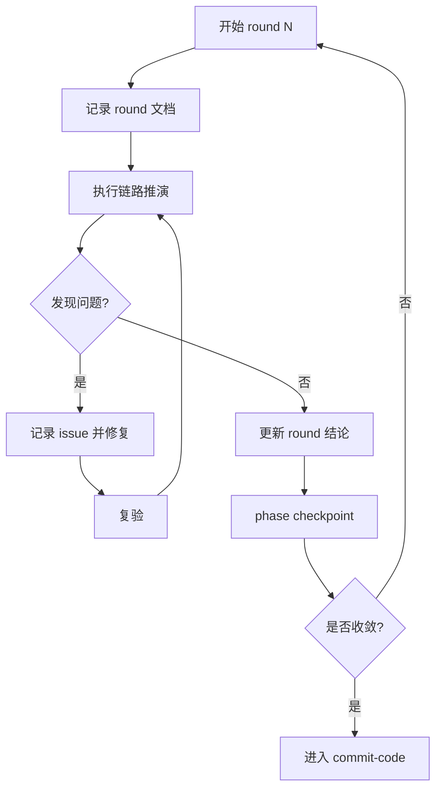

# Loop Refined

## 概述
`loop-refined` 是 cwork 的质量收敛核心。

它通过跨工程逻辑推演替代“必须新增单元测试”这一硬门禁，要求问题显式记录、修复、复验和关闭。

## 开始声明
建议先声明：
> 我正在使用 `loop-refined` 做跨工程推演与问题收敛。

## HARD GATE
- `workflow-state` 不在 `executing-plans/loop-refined`，禁止执行。
- 未记录 round 文档，禁止宣称收敛。
- 任一阻断问题状态为 `open`，禁止进入提交阶段。

## 本 skill 自带资产
- 脚本：`skills/loop-refined/scripts/record_loop_round.sh`
- 模板：
  - `skills/loop-refined/templates/round-report.md`
  - `skills/loop-refined/templates/issue-item.md`

## 每轮先落记录

```bash
bash skills/loop-refined/scripts/record_loop_round.sh \
  --main-dir <主工程绝对路径> \
  --requirement-key <需求key> \
  --round <轮次数字> \
  --summary "<本轮摘要>" \
  --open-issues <数量> \
  --closed-issues <数量> \
  --deps <逗号分隔依赖工程绝对路径>
```

脚本会自动：
- 生成 `process/round-<N>.md`
- 在主工程 `03-changes.md` 写入 Round 节
- 在依赖工程 `03-repo-changes.md` 补齐 Round 节

## 推演覆盖面（每轮至少）
1. 主路径闭环。
2. 异常路径（超时/失败/重试）。
3. 契约兼容（字段/状态/事件）。
4. 并发和重复触发防重。
5. 回滚补偿可执行性。

## 标准循环
1. 建范围：涉及工程、模块、链路。
2. 推演：逐条检查覆盖面。
3. 记问题：scope/root_cause/fix_plan/verify/status。
4. 实施最小修复。
5. 复验并更新状态。
6. 调用 `phase_checkpoint` 同步状态。

## 轮次检查点

```bash
bash skills/init/scripts/phase_checkpoint.sh \
  --main-dir <主工程绝对路径> \
  --deps <逗号分隔依赖工程绝对路径> \
  --requirement-key <需求key> \
  --phase loop-refined \
  --owner <agent-id>
```

## 流程图


## 常见失败与恢复
- 失败：同类问题反复出现。
  - 恢复：提升到根因层（契约/状态机/并发模型）修复。
- 失败：主工程与依赖工程记录冲突。
  - 恢复：以主工程总记录统一口径并同步依赖工程。
- 失败：轮次文件缺失导致不可追溯。
  - 恢复：补建 round 文件并回填证据。

## 反模式
- 只改代码不记录推演证据。
- 标记“通过”但没有最新轮次记录。
- open 问题挂着直接进提交。

## 完成定义
- 所有问题状态 `closed`。
- 最新一轮无新增高优问题。
- 主/依赖工程推演文档一致。

下一阶段：`commit-code`

## 示例
- `skills/loop-refined/logic-probe-checklist.md`
- `skills/loop-refined/examples/sample-round.md`

