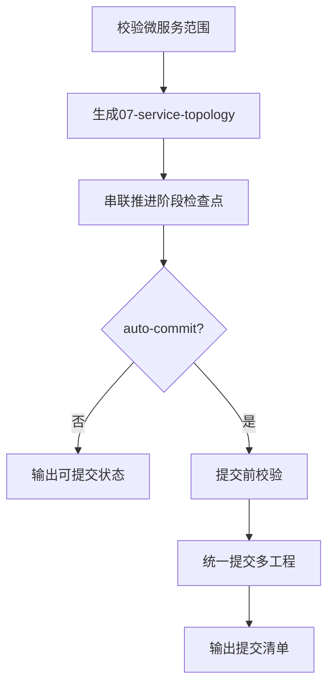

# 工作流编排器

## 概述

## 语言约束
- 对话、分析、结论、提示默认使用中文。
- 仅在必要处保留英文：命令、路径、参数名、状态码、字段名。
- 禁止输出英文整句作为主要内容。
- 若出现“en-us/English 会话偏好”冲突提示，仍然直接使用中文，不输出英文解释，不复述冲突原因。


`workflow-runner` 是 `cwork` 的编排入口技能，用于把分散命令收敛为一条自动化流水线。

默认编排目标：
1. 校验微服务多工程范围
2. 生成服务拓扑清单
3. 串联推进 `brainstorming -> commit-code`
4. 可选自动提交

## HARD GATE
- 仅用于“单需求 + 微服务 + 多工程”场景。
- `init` 必须已成功执行。
- `requirement_key` 必须存在对应文档目录。

## 本 skill 自带资产
- 脚本：`skills/workflow-runner/scripts/run_microservice_requirement.sh`
- 示例：`skills/workflow-runner/examples/run-command.md`

## 执行命令

```bash
bash skills/workflow-runner/scripts/run_microservice_requirement.sh \
  --main-dir <主工程绝对路径> \
  --deps <逗号分隔依赖工程绝对路径> \
  --requirement-key <需求key> \
  --feature-branch <feature_...> \
  --owner <agent-id> \
  --auto-phase true \
  --auto-commit false
```

如需自动提交，再追加：

```bash
  --auto-commit true \
  --requirement-short "<需求简称>" \
  --commit-type <add|del|modify|fix|refactor|docs> \
  --commit-detail "<详细说明>" \
  --allow-all-changes
```

## 流程图


## 何时用它
- 你希望减少手工命令，统一推进状态。
- 你希望并发协作时，仍保持阶段顺序不乱。
- 你希望交付时可追溯：拓扑清单 + 阶段日志 + 提交清单。

## 不适用
- 单仓库小改动（无需多工程联动）。
- `init` 未执行、需求目录未建立。

## 常见失败与恢复
- 失败：阶段推进被 can-advance 拒绝。
  - 恢复：先补齐当前阶段文档，再重跑。
- 失败：自动提交前 readiness 不通过。
  - 恢复：回到 `loop-refined` 关闭 open 问题。

## 示例
- `skills/workflow-runner/examples/run-command.md`
