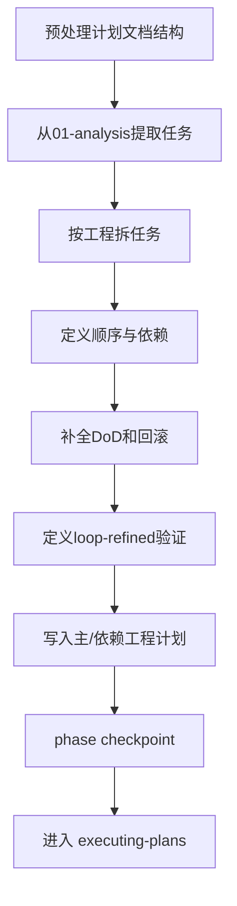

# 编写执行计划

## 概述

## 语言约束
- 对话、分析、结论、提示默认使用中文。
- 仅在必要处保留英文：命令、路径、参数名、状态码、字段名。
- 禁止输出英文整句作为主要内容。

`writing-plans` 负责把分析文档翻译成“可执行任务图”。

计划必须能被不同 agent 独立执行，并在多工程下保持一致。

## 开始声明
建议先声明：
> 我正在使用 `writing-plans` 生成跨工程执行计划。

## HARD GATE
- `workflow-state` 不是 `brainstorming`，禁止执行。
- 任一任务缺 DoD，禁止推进。
- 跨工程顺序未定义，禁止推进。

## 本 skill 自带资产
- 脚本：`skills/writing-plans/scripts/prepare_plan_docs.sh`
- 模板：
  - `skills/writing-plans/templates/plan-main.md`
  - `skills/writing-plans/templates/plan-repo.md`

## 先执行计划文档预处理

```bash
bash skills/writing-plans/scripts/prepare_plan_docs.sh \
  --main-dir <主工程绝对路径> \
  --requirement-key <需求key> \
  --deps <逗号分隔依赖工程绝对路径>
```

## 任务编排原则
1. 先依赖后主工程。
2. 每任务只承载一个可验证目标。
3. 每任务必须包含：工程归属、前置依赖、DoD、回滚。
4. 默认验证主策略：`loop-refined`。

## 推荐任务模板
- 任务名
- 归属工程（绝对路径）
- 前置任务
- 变更模块/文件
- 执行步骤
- 验证方式（第几轮 loop-refined）
- DoD
- 回滚策略

## 输出文件
主工程：`docs/requirements/<requirement_key>/02-plan.md`

依赖工程：`docs/requirements/<requirement_key>/02-repo-plan.md`

## 流程图


## 阶段推进命令

```bash
bash skills/init/scripts/phase_checkpoint.sh \
  --main-dir <主工程绝对路径> \
  --deps <逗号分隔依赖工程绝对路径> \
  --requirement-key <需求key> \
  --phase writing-plans \
  --owner <agent-id>
```

## 常见失败与恢复
- 失败：任务过大不可验证。
  - 恢复：拆分为更小任务，保持独立 DoD。
- 失败：依赖顺序不清，执行时打架。
  - 恢复：补“前置依赖”并重新排序。
- 失败：回滚策略缺失。
  - 恢复：补具体回滚路径，不允许写“按需回滚”。

## 反模式
- 把计划写成“讨论纪要”而不是任务清单。
- 不写具体工程归属。
- 只写执行，不写验证和收口条件。

## 完成定义
- `02-plan.md` 与 `02-repo-plan.md` 完整。
- 所有任务具备可执行要素（归属/DoD/回滚/验证）。
- `phase_checkpoint` 返回 `CHECKPOINT_DONE`。

下一阶段：`executing-plans`

## 示例
- `skills/writing-plans/plan-document-reviewer-prompt.md`
- `skills/writing-plans/plan-reviewer-prompt.md`
- `skills/writing-plans/examples/sample-plan.md`

